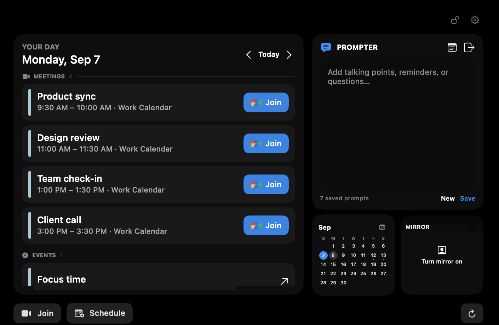
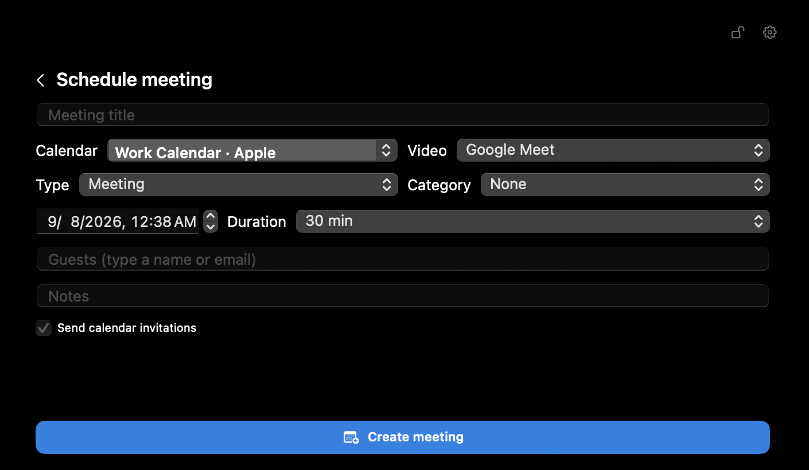
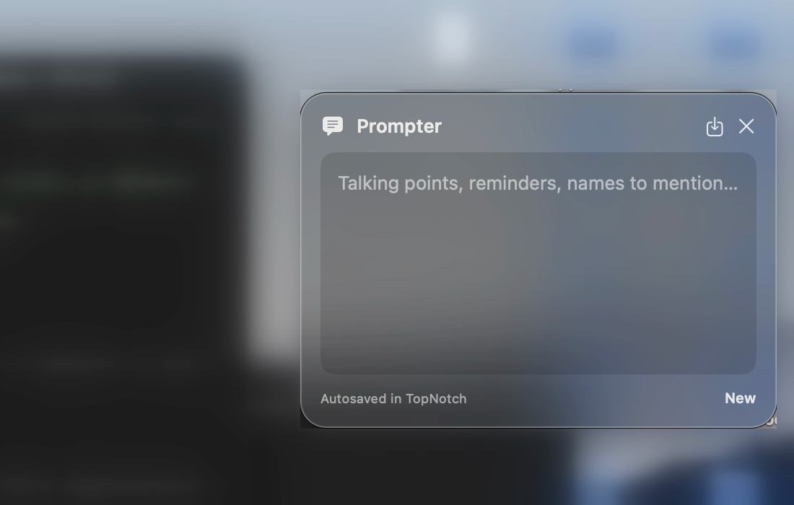

# TopNotch

### Your day, meetings, and talking points—right beside the MacBook notch.

TopNotch turns the space around your notch into a focused command center for calendars, video calls, and the moments that matter next.

[**Download TopNotch v1.0 →**](https://github.com/dhwani2198/TopNotch-Releases/releases/latest)

Apple Silicon · macOS 15+

---

## Your day, without breaking focus

See meetings and events in one glance, jump into the right Google Meet, Zoom, or Microsoft Teams call, keep notes nearby, and check the day ahead—all without opening another full-size app.

  

## From idea to invite in seconds

Create a meeting, event, or task from the notch. Choose a connected calendar, add guests from your contacts, and attach Google Meet, Zoom, Microsoft Teams, or no video call at all.

  

## Keep your talking points on screen

Prompter saves notes and reminders inside TopNotch, with history available through Apple Notes. Pull it out into a compact liquid-glass window during a call, then close it back into the notch when you are done.

  

## Know exactly when it is time

When a meeting, event, or task starts, TopNotch briefly traces the notch with the selected accent color. The blue start alert is visible without keeping the dashboard open—and disappears after the moment has passed.

  

## Made for the calendars and calls you already use

| Calendars | Meetings | Contacts and notes |
| --- | --- | --- |
| Apple Calendar | Google Meet | Apple Contacts |
| Google Calendar | Zoom | Google Contacts |
| Outlook Calendar | Microsoft Teams | Microsoft Contacts and Apple Notes |

## Download

Download the newest Apple Silicon DMG from [**GitHub Releases**](https://github.com/dhwani2198/TopNotch-Releases/releases/latest).

TopNotch currently supports M-series Macs running macOS 15 or newer. Intel Macs are not supported.

## Install

1. Open the downloaded DMG.
2. Drag **TopNotch** into **Applications**.
3. Open TopNotch from Applications.
4. Because this beta is not Apple-notarized, macOS may block the first launch. Open **System Settings → Privacy & Security**, find the TopNotch message, and click **Open Anyway**.

Only download TopNotch from this repository. Each release includes a SHA-256 checksum for verifying the DMG.

## Privacy and source code

This public repository contains downloads and release documentation only. TopNotch's proprietary application and backend source code are maintained separately in a private repository and are not published here.

TopNotch uses its hosted integration service to connect meeting providers without embedding private server API keys in the application bundle.

## Support

Report a download or installation problem through this repository's [Issues](https://github.com/dhwani2198/TopNotch-Releases/issues).
