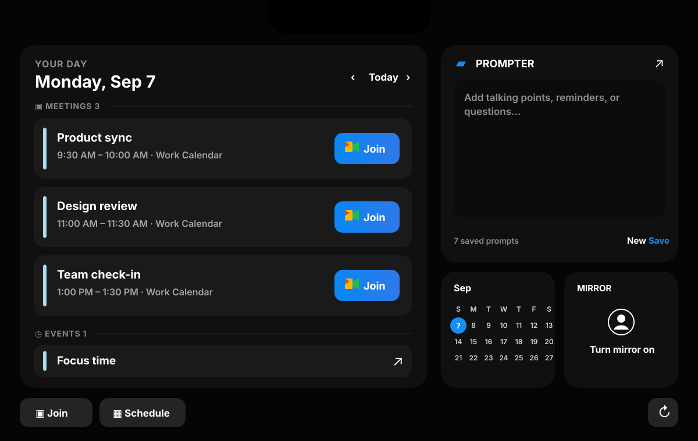
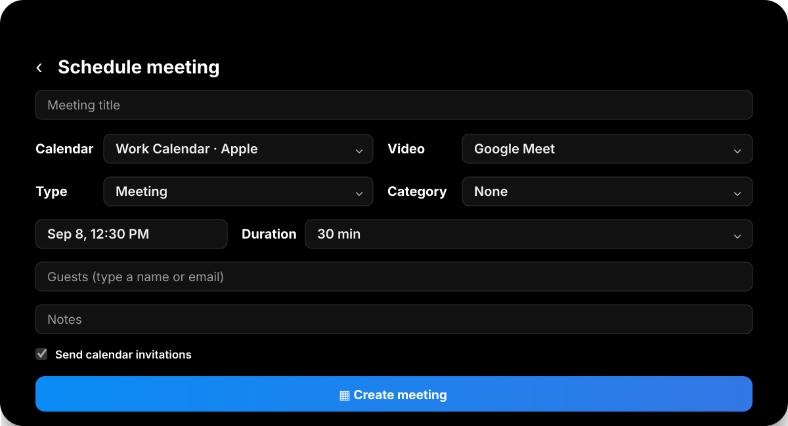

# TopNotch

**v1.0 · September 2026**

Apple Silicon · macOS 15+

---

## Introducing TopNotch
I built TopNotch because I kept alt-tabbing away from whatever I was doing just to check what meeting was next. It sits in the area around the MacBook notch — a floating pill if your Mac doesn’t have one — and stays out of the way until you hover over it. Open it and you get today’s calendar, a button to join whatever’s next, a way to schedule something new, and a place to keep notes you want in front of you during a call.

v1.0 · September 2026
Apple Silicon · macOS 15+

[**Download TopNotch v1.0 →**](https://github.com/dhwani2198/TopNotch-Releases/releases/latest)

One thing up front: this repo is releases and docs only. The app itself — the Swift, the backend, all of it — lives in a private repo and isn’t open source right now. Ask me anything about how it works, I just can’t hand you the code.

  

## Create the next thing in seconds

Create a meeting, event, or task from the notch. Choose a connected calendar, add guests from your contacts, and attach Google Meet, Zoom, Microsoft Teams, or no video call at all.

  

## Keep your talking points in view

Prompter saves notes and reminders inside TopNotch, with history available through Apple Notes. Pull it out into a compact liquid-glass window during a call, then close it back into the notch when you are done.

## Integrations in v1.0

| Calendars        | Meetings        | Contacts             | Notes                    |
| ----------------- | --------------- | --------------------- | ------------------------ |
| Apple Calendar    | Google Meet     | Apple Contacts         | Apple Notes (via Prompter) |
| Google Calendar   | Zoom            | Google Contacts        |                           |
| Outlook Calendar  | Microsoft Teams | Microsoft Contacts     |                           |

When a meeting is close, the notch gives a short blue signal so you know it's time to join — you don't have to have the panel open to catch it.

## Creating something new

From the notch: pick which connected calendar it goes on, add guests straight from your synced contacts, and attach Google Meet, Zoom, Teams, or no call at all. It's a meeting, an event, or a task — same flow for all three.

## Prompter

This is the notes feature. Whatever you jot down in Prompter syncs with Apple Notes, so the history isn't locked inside the app. During a call you can pull it out into its own small floating window, then tuck it back into the notch when you're done.

## How the integrations actually work

I can't show you the source, but here's the part that matters if you're wondering how this is built: no API keys or OAuth secrets ship inside the app bundle. Every calendar and meeting connection goes through a hosted service I run — the app talks to that service, the service holds the credentials. That's also why there's no self-hosting path right now; the app isn't built to run those integrations on its own.

## Download

Grab the DMG from [**GitHub Releases**](https://github.com/dhwani2198/TopNotch-Releases/releases/latest).

TopNotch currently supports M-series Macs running macOS 15 or newer. Intel Macs are not supported.

## Install

1. Open the downloaded DMG.
2. Drag **TopNotch** into **Applications**.
3. Open TopNotch from Applications.
4. Because this beta is not Apple-notarized, macOS may block the first launch. Open **System Settings → Privacy & Security**, find the TopNotch message, and click **Open Anyway**.

Only pull builds from this repo. Every release ships a SHA-256 checksum so you can verify the DMG matches what I actually built.

## Support

Report a download or installation problem through this repository's [Issues](https://github.com/dhwani2198/TopNotch-Releases/issues).
